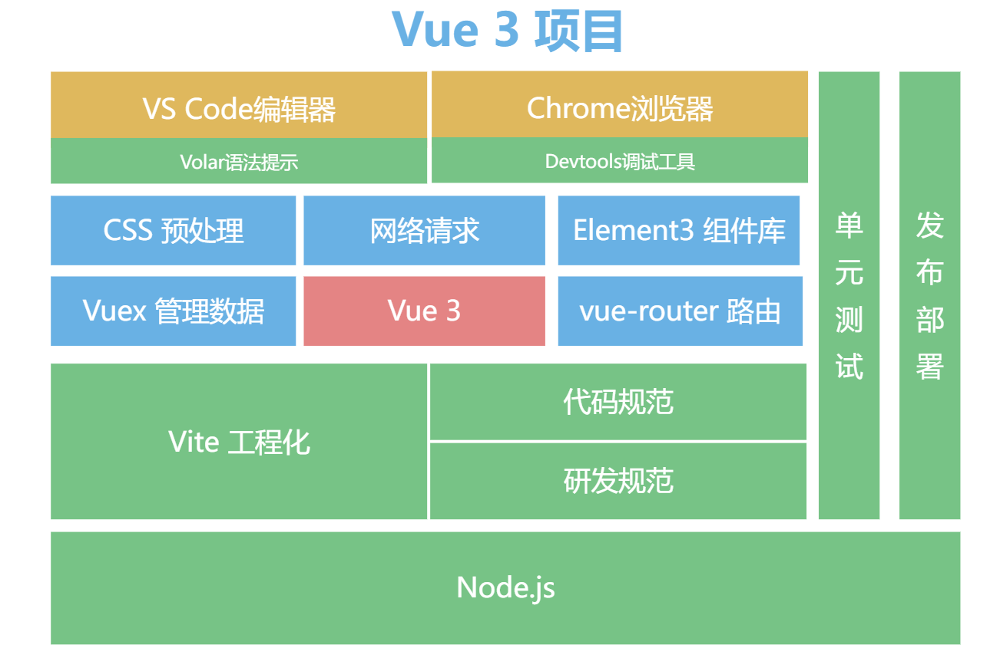
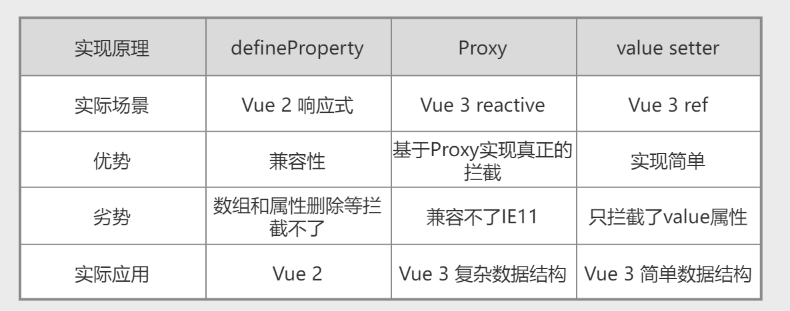
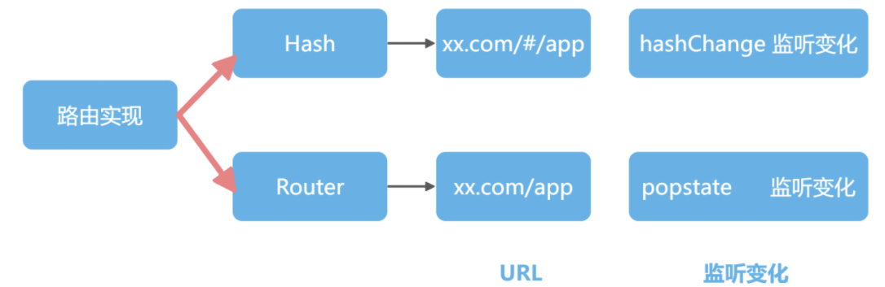
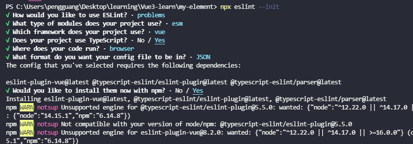
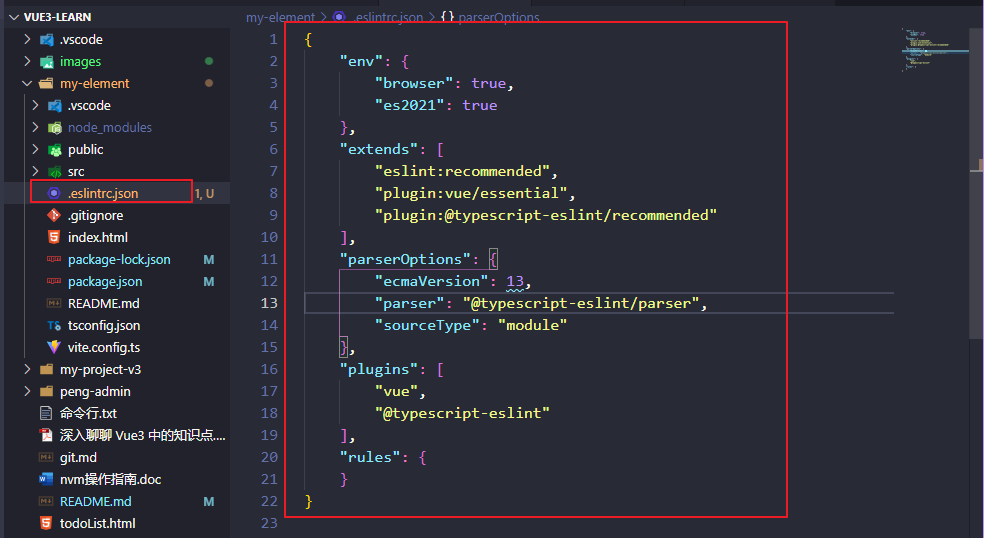
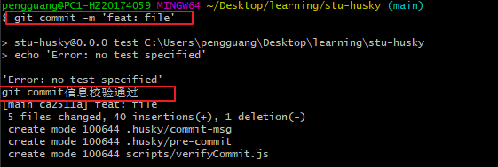
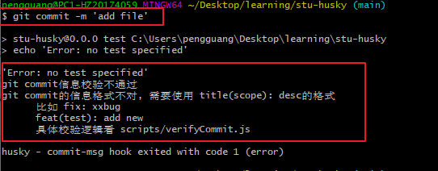

# Vue3 学习笔记

[gitHub](https://github.com/vuejs)

## 环境

- Chrome 浏览器
- Vue 3
- VS Code 编辑器 + Volar
- vite

## 步骤

```shell
npm init vite@latest
```

Vue 负责核心，Vuex 负责管理数据， vue-router 负责管理路由

```shell
npm install vue-router@next vuex@next
```

```
.
├── README.md
├── index.html           入口文件
├── package.json
├── public               资源文件
│   └── favicon.ico
├── src                  源码
│   ├── App.vue          单文件组件
│   ├── assets
│   │   └── logo.png
│   ├── components
│   │   └── HelloWorld.vue
│   └── main.js          入口
└── vite.config.js    vite工程化配置文件
```

```
├── src
│   ├── api            数据请求
│   ├── assets         静态资源
│   ├── components     组件
│   ├── pages          页面
│   ├── router         路由配置
│   ├── store          vuex数据
│   └── utils          工具函数
```



Vue 中用过三种响应式解决方案，分别是 defineProperty、Proxy 和 value setter



## 对比区别

### router.js

```js
import { createRouter, createWebHashHistory } from 'vue-router'
// createRouter ： 新建路由事例
// createWebHashHistory : 配置内部使用 hash 模式的路由

const routes = []

const router = createRouter({
  history: createWebHashHistory(),
  routes,
})
export default router
```

### mian.js

```js
import { createApp } from 'vue'

import App from './App.vue'
import router from './router/index'

createApp(App).use(router).mount('#app')
```

### ref 和 reactive 的区别

- reactive 和 ref 都是用来定义响应式数据的 reactive更推荐去定义复杂的数据类型 ref 更推荐定义基本类型
- ref 和 reactive 本质我们可以简单的理解为ref是对reactive的二次包装, ref定义的数据访问的时候要多一个.value
- 使用ref定义基本数据类型,ref也可以定义数组和对象。

### watch 和 watchEffect 的区别

watch:

1. 具有一定的惰性 lazy 第一次页面展示的时候不会执行，只有数据变化的时候才会执行；也可立即执行：immediate: true
2. 参数可以拿到当前值和原始值
3. 可以侦听多个数据的变化，用一个侦听起承载

watchEffect:

没有过多的参数 只有一个回调函数

1. 立即执行，没有惰性，页面的首次加载就会执行。
2. 自动检测内部代码，代码中有依赖 便会执行
3. 不需要传递要侦听的内容 会自动感知代码依赖，不需要传递很多参数，只要传递一个回调函数
4. 不能获取之前数据的值 只能获取当前值
5. 一些异步的操作放在这里会更加合适

## vuex

```shell
npm install vuex@next
```

对于一个数据，如果只是组件内部使用就是用 ref 管理；如果我们需要跨组件，跨页面共享的时候，我们就需要把数据从 Vue 的组件内部抽离出来，放在 Vuex 中去管理。

使用 state 定义数据，使用 mutation 定义修改数据的逻辑，并且在组件中使用 commit 去调用 mutations。在此基础之上，还可以用 getters 去实现 Vuex 世界的计算属性，使用 action 来去定义异步任务，并且在内部调用 mutation 去同步数据。

## vue-router



## JSX

   - JSX 可以支持更动态的需求。而 template 则因为语法限制原因，不能够像 JSX 那样可以支持更动态的需求。
  - JSX 可以一个文件内返回多个组件
  - 我们实现业务需求的时候，也是优先使用 template，动态性要求较高的组件使用 JSX 实现
  - template 牺牲灵活性换来了静态标记的收益

## API

### globalProperties

添加一个可以在应用的任何组件实例中访问的全局 property
```js
// 之前(Vue 2.x)
Vue.prototype.$http = () => {}

// 之后(Vue 3.x)
const app = createApp({})
app.config.globalProperties.$http = () => {}
```

### teleport
```js
 <teleport to="body">
    内容
 </teleport>
```

## composition API

  - setup
  - ref
    - 定义简单数据类型为响应式数据
    - 单个元素：先申明ref响应式数据，返回给模版使用，通过ref绑定数据
    - 遍历的元素：先定义一个空数组，定一个函数获取元素，返回给模版使用，通过ref绑定这个函数
  - reactive
    - 定义一个复杂数据类型，成为响应式数据
  - watchEffect
  - watch
  - computed
    - 给 computed 传入函数，返回值就是计算属性的值
    - 给 computed 传入对象，get获取计算属性的值，set监听计算属性改变
  - toRef  
    - 转换响应式对象中某个属性为单独响应式数据，并且值是关联的
    - 从响应式数据对象中解构出的属性数据，不再是响应式数据
    - const xx = roRef(obj, 'xx')
    - 使用场景：有一个响应式对象数据，但是模版中只需要使用其中一项数据。
  - toRefs  
    - 转换响应式对象中所有属性为单独响应式数据，对象成普通对象，值是关联的
    - 常用于解构 reactive 定义对象
  - provide
    - 提供数据和函数给后代组件使用
  - inject
    - 给当前组件注入provide提供的数据和函数
  - 生命周期的 hooks

### provide 与 inject

## typescript

安装：
```shell
vue add typescript
```

## eslint

安装：
```shell
npm i eslint -D
```
项目根目录执行:
```shell
npx eslint --init
```

然后根据提示创建配置文件:



即可生成 eslint 文件：




## husky

[官网](https://typicode.github.io/husky/#/?id=features)

```shell
# 手动
npm install -D husky # 安装husky
npx husky install    # 初始化husky

# 自动 并生成 per-commit 文件
npx husky-init
npm install

# 新增commit msg钩子
npx husky add .husky/commit-msg "node scripts/verifyCommit.js" 
# npx 不行的话，可以使用 yarn
yarn husky add .husky/commit-msg "node scripts/verifyCommit.js" 
```

在 verifyCommit 文件里面添加：
feat 代表新功能，docs 代表文档，perf 代表性能等
```js
const msg = require('fs')
  .readFileSync('.git/COMMIT_EDITMSG', 'utf-8')
  .trim()
  
const commitRE = /^(revert: )?(feat|fix|docs|dx|style|refactor|perf|test|workflow|build|ci|chore|types|wip|release)(\(.+\))?: .{1,50}/

const mergeRe = /^(Merge pull request|Merge branch)/

if (!commitRE.test(msg)) {
  if(!mergeRe.test(msg)){
    console.log('git commit信息校验不通过')

    console.error(`git commit的信息格式不对, 需要使用 title(scope): desc的格式
      比如 fix: xxbug
      feat(test): add new 
      具体校验逻辑看 scripts/verifyCommit.js
    `)
    process.exit(1)
  }

}else{
  console.log('git commit信息校验通过')
}
```

`commit-msg`: 代码执行提交的时候执行；
`pre-commit`: 代码执行之前的钩子； 可以执行 `ESLint` 代码格式；
这样在 git commit 的同时先进行 ESLint 校验，然后再执行 commit 的 log 信息格式检查

```shell
npx husky add .husky/pre-commit "npm run lint"
```

提交成功:



提交成功:




## 请求

  - 正常请求： axios
    - npm i axios -D

  - jsonp接口： fetch-jsonp [github](https://github.com/camsong/fetch-jsonp)


### sass

vite: npm i sass -D

webpack: npm i node-sass sass-loader -D

## 引入第三方库注意事项

  - 使用之初考虑到项目的长期可维护性
  - 少用全局变量
  - 注意按需加载


## 查询一个页面有多少 HTML 标签
new Set([...document.querySelectorAll('*')].map(n=>n.nodeName)).size

## 性能优化

网络请求优化和代码效率优化

- FCP： First Contentful Paint  页面上呈现第一个 DOM 元素的时间
- TTL： Time to Interactive  页面可以开始交互时间
- LCP:  Largest Contentful Paint  页面视口上最大的图片或文本渲染的时间

### rollup-plugin-visualizer

```shell
npm i rollup-plugin-visualizer -D
```

```js
vite.config.js 引入：

import { visualizer } from 'rollup-plugin-visualizer'

plugins: [
  visualizer()
]
```

### 客户端性能检测

```js
let timing = window.performance && window.performance.timing
let navigation = window.performance && window.performance.navigation

DNS 解析：
let dns = timing.domainLookupEnd - timing.domainLookupStart

总体网络交互耗时：
let network = timing.responseEnd - timing.navigationStart

渲染处理：
let processing = (timing.domComplete || timing.domLoading) - timing.domLoading

可交互：
let active = timing.domInteractive - timing.navigationStart
```

### 好项目

STAR： Situation（情景）、Task（任务）、Action（行动）和 Result（结果）