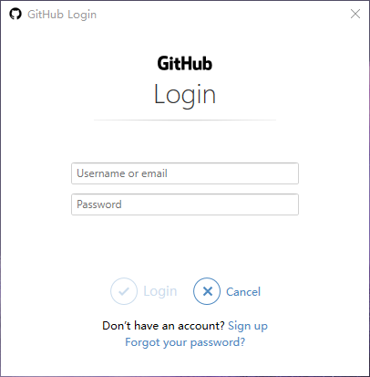
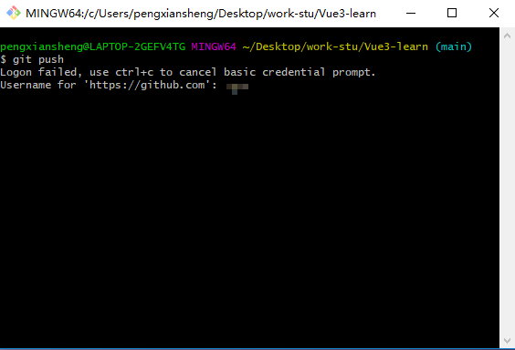
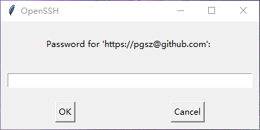
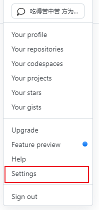
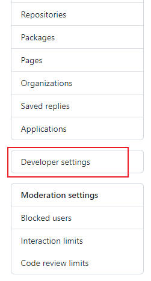
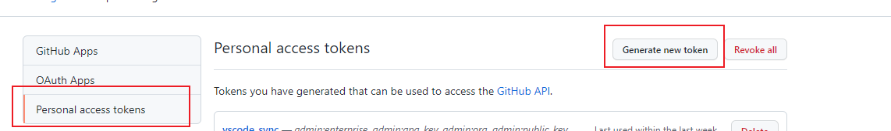
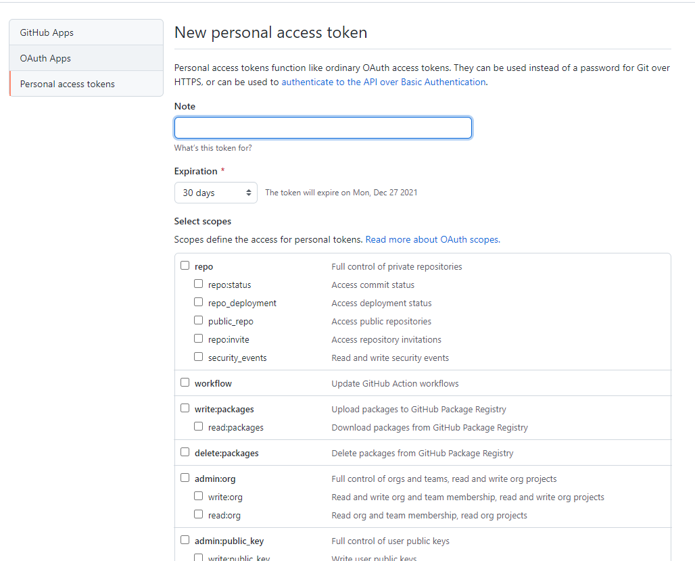

# git 一些操作和问题记录


## git 第一次关联时

### 第一次 git commit -m 'xxx' 时，需要输入 邮箱和用户名：

```js
git config --global user.email "you@example.com"

git config --global user.name "Your Name"
```

### 第一次 push 时需要关联，会弹出如下框：

输入 username or email  和 password （就是 github 的登录密码）：


点击确定，需要输入 username：


点击回车，弹出如下框，输入生成的 `Personal access tokens`，不是登录密码



## 生成 Personal access token

1. 点击菜单栏的（个人图像下）`Settings`：

     

2. 点击左侧菜单栏的 `Developer settings`
   
     

3. 点击左侧的 `Personal access tokens`，再点击右上边的 `Generate new token`
     
     

4. 创建token
     
     


## git log 退出方法

  按字母 **Q** 即可退出